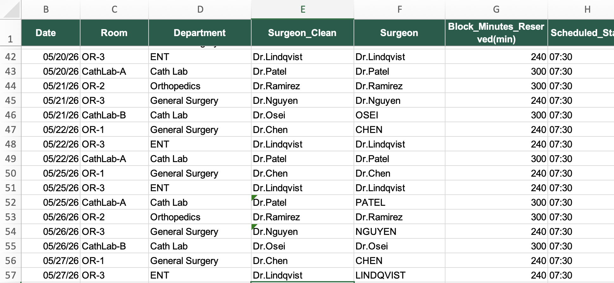

# Operating Room Utilization Rate Project
## Project Introduction
Scenario: Hospital-wide OR unilization for July came in noticeably lower than May, and the Perioperative administration wants to understand why before the next block time review meeting. I have been given two tabs:

1) Block_Schedule, the standing weekly block time allocation (which room/surgeon/department owns which timr slots).
2) OR_Case_Log, every schedule case attempt in May and July, including cases that were canccelled, with a reseaon code where available.

Task: 
- Calculate OR utilication (actual case time / reserved block time) by room, for May vs. July.
- Identify the most likely root casue using the data available.
- Estimate the impact (lost OR time, dollar impact if there is reasonable basis for it).
- Be ready to give concrete next step for Perioperative administration.

## Step 1: Data Integrity Check and Cleaning

Data Integrity: check the date of this data set to see if it is what is required by our stakeholders, in this case, May and July should be included. Furthermore, check if all the Departments and Rooms data are included to ensure data complete.

Data Cleaning: 

1) First make sure all the data formats are correct. Date format aligned check. 
2) Look for duplicates and blank cells. Confirm if data needs to be updated/corrected, or should be removed. 
3) Make sure data is clean by aliging entry format. Make sure all the room names follow this format: OR-1, OR-2, OR-3, CathLab-A, Cathlab-B, ENT, General Surgery, Orthopedics. Functions involved `find`, `replace`. Make sure Surgeon names are aligned format as well, using `=PROPER`, `="text"& PROPER` to ensure all the names are "DR.lastname".

Below image is what cleaned data looks like:

